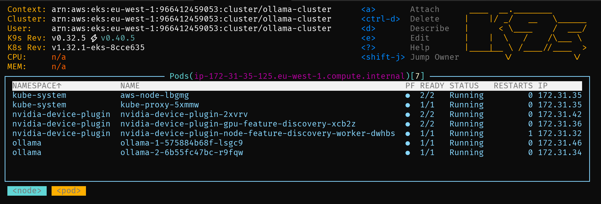

# GPU Cost Optimisation with Kubernetes

## **Table of Contents**
1. [Overview](#overview)
2. [Why This Project?](#why-this-project)
3. [Project Structure](#project-structure)
4. [Key Features](#key-features)
5. [Setup Guide](#setup-guide)
   - [Provision GPU Nodes](#1️⃣-provision-gpu-nodes)
   - [Enable GPU Access](#2️⃣-enable-gpu-access)
     - [Option 1: Enable CUDA Time Slicing](#option-1-enable-cuda-time-slicing)
     - [Option 2: Enable CUDA MPS](#option-2-enable-cuda-mps-multi-process-service)
   - [Configure GPU Usage in Pods](#3️⃣-configure-gpu-usage-in-pods)
6. [CUDA MPS vs. Time Slicing](#cuda-mps-vs-time-slicing)
   - [Choosing Between Time Slicing and MPS](#choosing-between-time-slicing-and-mps)
7. [Visual Demonstrations](#visual-demonstrations)
8. [Teardown Guide](#teardown-guide)
9. [Future Enhancements](#future-enhancements)


## **Overview**

**Kubernetes** has become the **de facto standard** for managing all types of workloads, providing scalability, automation, and efficient resource management.

**AI workloads** perform significantly better on **GPUs** compared to CPUs, as GPUs are optimized for parallel processing, which is essential for deep learning and inference tasks.

To effectively utilize **GPUs** in **Kubernetes**, we need to perform three key tasks:

- 1️⃣ **Provision GPU nodes**: Create nodes or node groups with **GPU support** in our **K8S Cluster**.
- 2️⃣ **Enable GPU access**: Install device plugins that allow pods to use specialized hardware features like GPUs.
- 3️⃣ **Configure GPU usage in pods**: Ensure that workloads explicitly request and leverage GPU resources.

This project demonstrates cost-effective ways to run GPU workloads, using AWS in this case, but these methods can be applied to any cloud provider. By leveraging **NVIDIA device plugin** for **Kubernetes's GPU sharing features**, we can efficiently share GPU resources across multiple workloads while **minimising expenses**.

## **Why This Project?**

High-performance GPUs like **NVIDIA A100** or **H100** can be **prohibitively expensive** when running AI workloads. This project shows how to:

- ✅ **Share a single GPU** between multiple AI models with **CUDA**(Compute Unified Device Architecture).
- ✅ Compare **CUDA MPS** and **CUDA Time Slicing** for shared GPU usage.
- ✅ **Use Spot Instances** to save up to **90% on GPU costs**.

## **Project Structure**
```
/gpu-cost-optimisation
  ├── /cuda            # CUDA configs for dynamic GPU sharing
  ├── /olama           # Ollama AI model values configuration
  ├── /results         # Benchmark results and performance comparisons
  ├── /README.md       # Documentation and setup guide
```

## **Key Features**

- Deploy **GPU workloads** on **AWS EKS** using **Spot Instances**.
- Use **NVEDIA CUDA** to run **multiple AI models** on a **single GPU** dynamically.
- Real-time **monitoring** of GPU usage with **NVIDIA-SMI**.
- Compare **CUDA MPS vs. Time Slicing** and observe performance differences.


**Figure 1:** Two Ollama AI models ~~plotting~~ conversing with each other on the same GPU.
- :link: see [zellij config](resources/zellij/layout.md) for the dashboard used in this console.


## **Setup Guide**

### **1️⃣ Provision GPU Nodes**

#### **Step 1: Set Up Required Environment Variables**

Before deploying the cluster, set the following environment variables:

```sh
export AWS_ACCOUNT_ID="<aws-acccount-id>"
export SUBNET_IDS="subnet-0bcd6d51,subnet-59f5923f"
export SECURITY_GROUP_IDS="sg-0643b1246dd531666"
export AWS_REGION="eu-west-1"
```

- **SUBNET_IDS**: Specifies the AWS subnets where the EKS cluster will be deployed. Ensure that these subnets are in a VPC with internet connectivity or the necessary private network access.
- **SECURITY_GROUP_IDS**: Defines the security groups that control inbound and outbound traffic to the EKS cluster. These should allow necessary Kubernetes communication and node access.

#### **Step 2: Deploy an AWS EKS Cluster**

Create the EKS cluster that will host GPU workloads:

```sh
aws eks create-cluster --name ollama-cluster \
  --role-arn arn:aws:iam::${AWS_ACCOUNT_ID}:role/EKSClusterRole \
  --resources-vpc-config subnetIds=${SUBNET_IDS},securityGroupIds=${SECURITY_GROUP_IDS} \
  --kubernetes-version 1.32 \
  --region ${AWS_REGION}
```

#### **Step 3: Deploy CPU Nodes for the Control Plane**

```sh
aws eks create-nodegroup \
  --cluster-name ollama-cluster \
  --nodegroup-name cpu-system-nodes \
  --capacity-type ON_DEMAND \
  --instance-types t3.medium \
  --ami-type AL2_x86_64 \
  --scaling-config minSize=1,maxSize=3,desiredSize=1 \
  --node-role arn:aws:iam::${AWS_ACCOUNT_ID}:role/EKSNodeRole \
  --subnets ${SUBNET_IDS//,/ } \
  --region ${AWS_REGION} \
  --labels node-type=cpu,system=true
```

- **`--labels node-type=cpu,system=true`**: Labels are metadata tags that help Kubernetes schedule workloads effectively. In this case:
  - `node-type=cpu` ensures the node group is identified as a CPU-based system.
  - `system=true` may be used to indicate nodes dedicated for system-level workloads, such as control plane operations or background services.

#### **Step 4: Deploy GPU-enabled Spot Node Group**

```sh
aws eks create-nodegroup \
  --cluster-name ollama-cluster \
  --nodegroup-name gpu-spot-nodes \
  --capacity-type SPOT \
  --instance-types g4dn.xlarge \
  --ami-type AL2_x86_64_GPU \
  --scaling-config minSize=0,maxSize=1,desiredSize=1 \
  --node-role arn:aws:iam::${AWS_ACCOUNT_ID}:role/EKSNodeRole \
  --subnets  ${SUBNET_IDS//,/ } \
  --region ${AWS_REGION} \
  --labels node-type=gpu \
  --taints key=nvidia.com/gpu,value=present,effect=NO_SCHEDULE
```

- **Spot Instances (`--capacity-type SPOT`)**: AWS Spot Instances allow you to run workloads at a significantly reduced cost compared to on-demand pricing. However, they can be interrupted if AWS reclaims the capacity.
- **GPU Instance Type (`--instance-types g4dn.xlarge`)**: The `g4dn.xlarge` instance provides a single NVIDIA T4 GPU, making it cost-effective for AI inference and smaller training workloads.
- **AMI Type (`--ami-type AL2_x86_64_GPU`)**: Specifies an Amazon Linux 2 AMI that comes with NVIDIA drivers pre-installed.
- **Labels (`--labels node-type=gpu`)**: Helps Kubernetes identify that this node group is GPU-based, so it can be scheduled appropriately.
- **Taints (`--taints key=nvidia.com/gpu,value=present,effect=NO_SCHEDULE`)**: Ensures that only workloads requesting GPUs are scheduled on these nodes.

✅ **Spot Instances reduce GPU costs significantly but may not be suitable for workloads requiring guaranteed availability.**

## **2️⃣ Enable GPU Access**

### **Install NVIDIA K8s Device Plugin**

To enable **GPU access** in Kubernetes, install the **NVIDIA K8s Device Plugin** from:

👉 [NVIDIA/k8s-device-plugin](https://github.com/NVIDIA/k8s-device-plugin)

#### **Why Do You Need This?**
- The **NVIDIA GPU device plugin** allows Kubernetes to **detect and allocate GPUs** to workloads.
- Without this plugin, Kubernetes won’t recognize GPUs, even if a node has an **NVIDIA GPU**.
- Required for both **GPU sharing** features.
- There are two mutually exclusive modes of GPU sharing: **Time-Slicing** and **Multi-Process Service (MPS)**.

---

#### **Option 1: Enable CUDA Time Slicing**

CUDA **Time Slicing** allows multiple workloads to share a single GPU by allocating usage time slots.

##### **Step 1: Deploy NVIDIA Device Plugin with Time Slicing**
```sh
helm repo add nvdp https://nvidia.github.io/k8s-device-plugin
helm repo update

helm upgrade -i nvidia-device-plugin nvdp/nvidia.github.io/k8s-device-plugin \
  --namespace nvidia-device-plugin \
  --create-namespace \
  --version 0.17.0 \
  --set gfd.enabled=true \
  --values cuda/cuda-time-slicing-values.yaml
```

##### **Step 2: Configure Time Slicing**
The configuration file **cuda/cuda-time-slicing-values.yaml** enables GPU sharing by defining how many workloads can run simultaneously on the same GPU.

```yaml
config:
  map:
    default: |-
      {
        "version": "v1",
        "sharing": {
          "timeSlicing": {
            "resources": [
              {
                "name": "nvidia.com/gpu",
                "replicas": 4
              }
            ]
          }
        }
      }
  default: "default"
```

**Explanation**
- **`"name": "nvidia.com/gpu"`** → Defines the GPU resource type recognized by Kubernetes.
- **`"replicas": 4`** → Allows up to **4 workloads** to share the same physical GPU by assigning time slices.
- **`"timeSlicing"`** → Enables GPU time-sharing rather than exclusive access per workload.

✅ **Use Case:** Suitable for large independent workloads that don't require concurrent GPU execution.

---

#### **Option 2: Enable CUDA MPS (Multi-Process Service)**

CUDA **MPS** allows multiple workloads to share a GPU **concurrently**, optimizing memory and compute utilization.

##### **Step 1: Connect to GPU Node**
Before enabling MPS, access a GPU node using **AWS Systems Manager (SSM)**:
```sh
aws ssm start-session --target $(aws ec2 describe-instances --region eu-west-1 \
  --filters "Name=instance-type,Values=g4dn.xlarge" "Name=instance-state-name,Values=running" \
  --query "Reservations[0].Instances[0].InstanceId" --output text) --region eu-west-1
```

##### **Step 2: Check GPU Compute Mode**
Verify the current GPU compute mode:
```sh
nvidia-smi -q | grep "Compute Mode"
```
If it returns `Default`, switch to `Exclusive Process` mode for MPS:

By default, most GPUs operate in **Default Compute Mode**, which allows multiple processes to use the GPU but prevents true concurrent execution. **Exclusive Process Mode** ensures that each CUDA application has exclusive access to a GPU partition, which is necessary for **MPS** to function efficiently.

- **Why is this needed?**
  - **Default Mode** does not allow efficient GPU sharing under MPS.
  - **Exclusive Process Mode** enables multiple processes to share GPU resources dynamically without blocking each other.
  - MPS **reduces context switching overhead** and **improves overall performance** when multiple workloads run simultaneously.  

```sh
sudo nvidia-smi -c EXCLUSIVE_PROCESS
```

##### **Step 3: Enable the MPS Daemon**

The **MPS Daemon** (Multi-Process Service Daemon) is a background process that enables multiple CUDA applications to share a GPU concurrently. It helps optimize GPU utilization by allowing multiple workloads to execute in parallel instead of time-slicing between them.

**Why is this needed?**
- Without the MPS daemon, CUDA workloads execute sequentially when running on a shared GPU.
- MPS enables **lower-latency, parallel execution** of multiple workloads, improving GPU efficiency.
- It allows AI models and inference tasks to share GPU memory and compute resources dynamically.

```sh
sudo nvidia-cuda-mps-control -d
```

##### **Step 4: Deploy NVIDIA Device Plugin with MPS**
```sh
helm repo add nvdp https://nvidia.github.io/k8s-device-plugin
helm repo update

helm upgrade -i nvidia-device-plugin nvdp/nvidia.github.io/k8s-device-plugin \
  --namespace nvidia-device-plugin \
  --create-namespace \
  --version 0.17.0 \
  --set gfd.enabled=true \
  --values cuda/cuda-mps-values.yaml
```

##### **Step 5: Configure MPS**
The configuration file **cuda/cuda-mps-values.yaml** enables **multi-process service**, allowing concurrent execution of multiple workloads on a single GPU.

```yaml
config:
  map:
    default: |-
      {
        "version": "v1",
        "sharing": {
          "mps": {
            "resources": [
              {
                "name": "nvidia.com/gpu",
                "replicas": 4
              }
            ]
          }
        }
      }
  default: "default"
```

**Explanation**
- **`"mps"`** → Enables CUDA Multi-Process Service (MPS).
- **`"replicas": 4`** → Allows **four workloads** to run **concurrently** on the same GPU.
- **More efficient memory utilization** compared to time-slicing.

✅ **Use Case:** Ideal for AI inference and workloads that benefit from concurrent execution.


### **3️⃣ Configure GPU Usage in Pods**

#### **How Pods Request GPUs**

In Kubernetes, pods request GPUs using **resource requests and limits** in their configuration. The **NVIDIA device plugin** registers GPUs as **extended resources**, which allows pods to specify GPU requirements explicitly.

- **Resource Requests (`requests`)**: Defines the minimum GPU resources a pod requires. Kubernetes guarantees this allocation.
- **Resource Limits (`limits`)**: Specifies the maximum GPU resources a pod can consume.
- **Runtime Class (`runtimeClassName`)**: Ensures the container runtime supports GPU acceleration.

When a pod requests a GPU, Kubernetes schedules it onto a node with an available GPU, based on the **NVIDIA device plugin's** registration.

**Configuration Example: GPU Requests in Ollama**

The configuration file **olama/ollama-1-values.yaml**:

```yaml
ollama:
  runtimeClassName: "nvidia"  # Ensures GPU-enabled runtime
  gpu:
    enabled: true             # Enables GPU usage
    type: 'nvidia'            # Specifies NVIDIA GPU type
    number: 1                 # Required by chart, set to same value as resources.limits.nvidia.com/gpu below
  resources:
    limits:
      nvidia.com/gpu: 1       # Maximum GPU resources assigned
    requests:
      nvidia.com/gpu: 1       # Minimum GPU resources required
```

#### **Deploying Ollama AI Instances**

Install two **Ollama AI** instances that will run on the GPU nodes:

```sh
helm upgrade -i ollama-1 ollama-helm/ollama --namespace ollama --create-namespace --values olama/ollama-1-values.yaml
helm upgrade -i ollama-2 ollama-helm/ollama --namespace ollama --create-namespace --values olama/ollama-2-values.yaml
```

#### **Explanation**
- **`runtimeClassName: "nvidia"`** → Ensures the container runs in an **NVIDIA GPU-enabled** runtime.
- **`gpu.enabled: true`** → Enables GPU acceleration for the container.
- **`resources.requests.nvidia.com/gpu: 1`** → Ensures at least **one GPU** is allocated for the pod.
- **`resources.limits.nvidia.com/gpu: 1`** → Ensures the pod **cannot exceed** one GPU.

✅ **This ensures each Ollama AI instance is scheduled on a node with an available GPU, utilizing Kubernetes’ GPU scheduling features.**


**Figure 2:** Two Ollama AI models running on the same GPU, with necessary NVEDIA device plugin and system pods


## **CUDA Time Slicing vs. MPS**

The following **animated GIFs** illustrate the differences between **Time Slicing** and **MPS** when running two Ollama models alongside `nvidia-smi`.

<table>
  <tr>
    <th style="padding: 10px; border: none; text-align: left; vertical-align: top;"><b>Time Slicing</b></th>
    <th style="padding: 10px; border: none; text-align: left; vertical-align: top;"><b>MPS</b></th>
  </tr>
  <tr>
    <td style="padding: 10px; border: none; vertical-align: top;"></td>
    <td style="padding: 10px; border: none; vertical-align: top;">
      
    </td>
  </tr>
  <tr>
    <td style="padding: 10px; border: none; vertical-align: top;">
      <b>GPU Utilization:</b> Above 90% when either AI is active.<br>
      <b>Memory Usage:</b> Chatbot 1 uses over 8GB, Chatbot 2 uses over 5GB.<br>
      <b>Total Memory Usage:</b> 14GB out of 16GB utilized.
      <b>Chatbot Response Speed:</b> 🚀 **Faster** due to full GPU access per request.<br>
    </td>
    <td style="padding: 10px; border: none; vertical-align: top;">
      <b>GPU Utilization:</b> Alternates between 15% and 40%.<br>
      <b>Memory Usage:</b> Each AI gets roughly 3.2GB.<br>
      <b>Total Memory Usage:</b> Evenly distributed across workloads.
      <b>Chatbot Response Speed:</b> 🐢 **Slower** due to shared GPU processing.<br>
    </td>
  </tr>
</table>  


### **Explanation of Feature Differences**

- **Time Slicing** assigns the entire GPU to a single process at a time, leading to full GPU utilization per workload. However, it introduces **latency when switching** between workloads and does not efficiently share memory.
- **MPS (Multi-Process Service)** allows multiple workloads to share GPU resources concurrently, leading to **better memory utilization** and **more stable GPU usage** but at the cost of **slower individual responses** since workloads must share compute power.

Below is a detailed comparison of the two approaches based on real test results:

| Feature               | **Time Slicing 🚀** | **MPS ⚡** |
|---------------------- |-------------------|-------------------|
| **Process Execution**  | **Alternates workloads (one at a time)** | **Runs multiple workloads in parallel** |
| **GPU Utilization**   | **Spikes to 90%+** when chatbot is active | **Fluctuates between 15% and 40%** |
| **Total Utilization** | **Near 100%, but fluctuates** | **Stable at lower utilization (~40%)** |
| **Latency (Response Time)**  | **Faster** 🚀 (Full GPU per chatbot) | **Slower** 🐢 (Shared GPU resources) |
| **Best For**         | **Low-latency, burst workloads** (single-task inference) | **Running multiple AI tasks together** |
| **Memory Sharing**   | ❌ **No** (each process gets its own memory) | ✅ **Yes** (evenly distributed) |
| **Memory Efficiency** | 🟡 **Medium** (unused memory stays allocated) | 🟢 **High** (memory dynamically shared) |
| **Total Memory Usage** | **Chatbot 1: 8GB+, Chatbot 2: 5GB+** (14GB used) | **Each AI gets ~3.2GB, well-distributed** |
| **Risk of Starvation** | ❌ **No** (full access when running) | ⚠️ **Possible if one AI dominates resources** |

✅ **Time Slicing is ideal for workloads that require low-latency responses**, but it can be inefficient with memory and GPU allocation.  
✅ **MPS provides better overall efficiency**, but individual workloads receive less GPU power, leading to slower responses.     |

### **Conclusion**

✅ If your goal is to run two or more Ollama models **efficiently**, MPS is the better choice as it ensures **steady GPU utilisation** and **maximises parallel execution**.


## **Teardown Guide**

:link: see [cleanup.md](cleanup.md)


## **Future Enhancements**

- ✅ Use **SPOT GPU Nodes**.

- 🔜 Introduce **MIG** on **A100 GPUs** for strict isolation.

  - **What is MIG (Multi-Instance GPU)?** MIG is a **hardware-based** GPU partitioning feature available on **NVIDIA A100 and newer GPUs**. It allows a single GPU to be **split into multiple isolated instances**, each behaving like a separate GPU.
  - **CUDA vs. MIG:** CUDA-based solutions like **MPS and Time Slicing** enable **software-level sharing**, whereas **MIG provides true hardware-level isolation**.
  - **Availability:** MIG is **not available on smaller AWS GPUs** like the T4 (used in `g4dn.xlarge` instances). It is primarily available on **A100 GPUs (********`p4`******** and ********`p5`******** instances)** in AWS, making it suitable for **multi-tenant GPU workloads with guaranteed performance**.

- 🔜 Enhance **auto-scaling** with **Knative**

  - **GPU node auto-scaling to zero**: Knative allows **on-demand scaling**, meaning GPU nodes can be **scaled down to zero** when not in use.
  - **Potential cost savings:** Since GPU instances are expensive, shutting them down when idle can **reduce costs significantly**—especially when running workloads that have sporadic GPU usage, such as inference services.

- 🔜 Compare additional **GPU-sharing strategies**.

- 🔜 Integrate **cost monitoring tools**.


